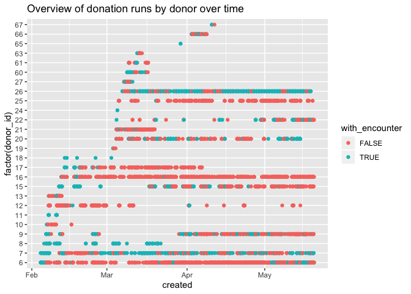
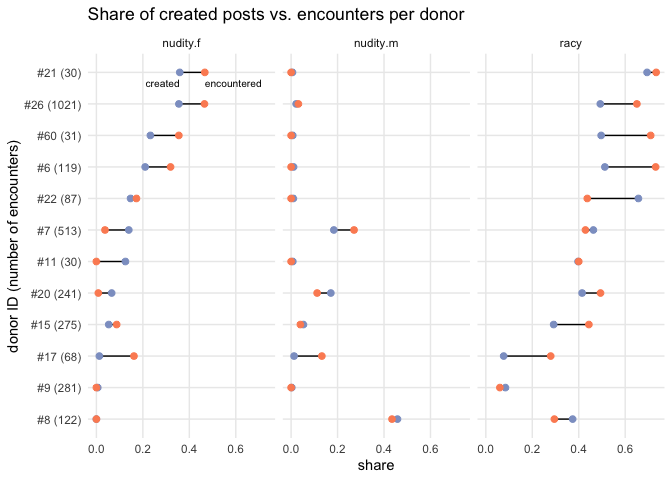
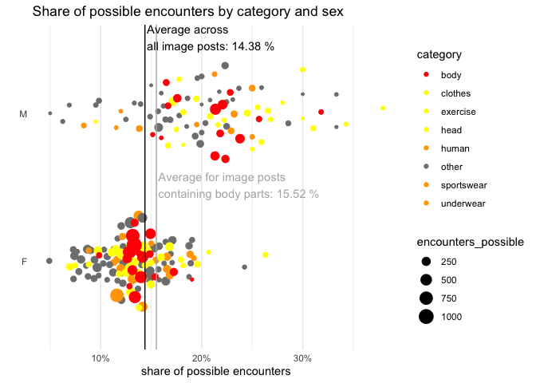
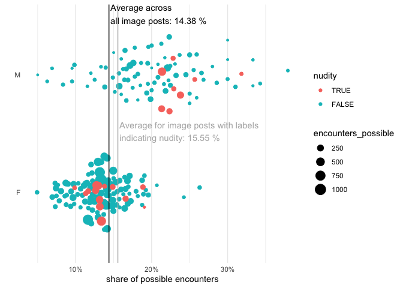

# Analysis of data

**Goal:** Test the main hypothesis: Pictures of women perform better if
they have less clothing on. This is not true for males.

**Tests:**

:white\_check\_mark: [**Question 1**](#question-1-raciness-share): Is
the **share of “racy” pictures higher in the feeds** of the donors,
compared with the share of racy pictures in the items posted by the
monitored accounts?

:white\_check\_mark: [**Question 2**](#question-2-label-analysis): Find
the **labels most often associated with “raciness” and nudity**. Check
if the effect is similar for male and female monitored accounts.

:white\_check\_mark: [**Question 3**](#question-3-nudity-share): Is the
**share of pictures containing nudity** higher in the feeds of the
donors, compared with the share of pictures containing nudity in the
items posted by the monitored accounts?

:white\_check\_mark: [**Question 4**](#question-4-individual-donors): Is
the share of pictures containing nudity **higher in the feeds of each
individual donor**, compared with the share of pictures containing
nudity in the items posted by the monitored accounts they follow?

:white\_check\_mark: [**Question 5**](#question-5-raciness-audience): Is
a post **shown to more donors** that follow the account if it’s racy?

:white\_check\_mark: [**Question
6**](#question-6-few-followed-accounts): Check if **data donors who are
following less than 5 accounts in total** have a similar pattern.

:white\_check\_mark: [**Question 7**](#question-7-nudity-audience):
Check if **specific labels** have a higher-than-average chance of being
in the feed of donors (e.g. “Bikini”, “Undergarment”, “Leg”, “Beauty”).
Check if the effect is similar for male and female monitored accounts.

Things to check:

  - Observed bias could be due to specific donors
  - Observed bias could be due to specific monitored users
  - Observed bias could be due to content creators removing rapidly the
    items that are not racy

# Setup

Follow the steps below in a terminal to load the database from a dump
file and save under the name `igdb`.

    pg_restore -f backup.sql 05-19_backup
    sudo -i -u postgres
    dropdb igdb
    createdb igdb
    igdb < backup.sql

Load packages needed.

# Read database

Create variables for the tables from the database needed for this
analysis:

    ##  [1] "auth_user_user_permissions"    "data_donors_datadonationerror" "django_migrations"            
    ##  [4] "django_session"                "auth_permission"               "auth_group"                   
    ##  [7] "django_content_type"           "auth_user_groups"              "auth_user"                    
    ## [10] "data_donors_donor"             "data_donors_datadonation"      "data_donors_donor_following"  
    ## [13] "data_donors_donorfollowing"    "data_donors_encounter"         "django_admin_log"             
    ## [16] "ig_observer_igpost"            "ig_observer_igimage"           "auth_group_permissions"       
    ## [19] "ig_observer_iguser"            "ig_observer_gvisionanalyse"

# Clean data

Extract analysis result from G vision JSON blob and save raciness rating
in new column called `racy`.

Merge relevant IG user data to post data

1.  Sex of IG user (column `sex`)

2.  How many donors with at least 1 data donation follow them (column
    `donor_followers`)

Merge relevant post data to image dataset

1.  Raciness analysis result

2.  Sex of IG user

Get dataset of image labels from G vision analysis.

    "ig_image_id" Image ID
    "mid"         Label ID
    "score"       Confidence of label [0.5,1]
    "topicality"  Importance of label for image [0.5,1]
    "description" Label text
    "ig_post_id"  Post ID
    "sex"         Sex of IG user
    "racy"        Raciness of image

# Descriptive analysis

## Number of posts

Monitored accounts posted 2825 containing 3351 images.

The analysis contains posts from users with at least 1 data donor that
made at least 1 donation following them.

That adds up to 2400 posts containing 2610 images.

## Number of encounters

    ## 3177 encounters total

    ## .
    ## contains image       no image 
    ##           2924            253

    ## 549 unique posts encountered

    ## .
    ## contains image       no image 
    ##            492             57

Around 4/5 posts were not encountered by any donors.

## Donors and monitored accounts

Number of monitored accounts by sex:

| sex | donor followers | no donor followers |
| :-- | --------------: | -----------------: |
| F   |              23 |                  7 |
| M   |              14 |                  1 |

Number of donors: 31

Number of donors with at least 1 donation: 26

Number of monitored accounts followed by at least 1 donor with at least
1 donation: 37 of 46

## Donation runs

<!-- -->

Some donors had more donation runs than others, and some encountered
more posts by monitored accounts than others.

# Question 1: Raciness share

## Analysis 1: Share comparison

Is the share of pictures labeled “racy” higher in the feeds of the
donors than in the items posted by the monitored accounts?\`

**Step 1:** Get share of *created* image posts containing racy pictures
(basis: collected posts by monitored accounts who are followed by at
least one data donor).

| sex | VERY\_LIKELY | LIKELY |
| :-- | -----------: | -----: |
| F   |        0.279 |  0.139 |
| M   |        0.104 |  0.161 |

Posts containing racy pictures in the content posted by monitored
accounts: 661 of 1737 posts (38.1 %).

To support our main hypothesis, the shares would need to be higher than
this in the encounters logged by data donors.

**Step 2:** Get share of *encountered* image posts containing racy
pictures (basis: all image posts from monitored accounts encountered by
donors).

`share_post`: Share of unique encountered posts with given raciness
rating

`share_encounter`: Share of encounters with given racinedd rating

| sex | racy         | share\_post | share\_encounters |
| :-- | :----------- | ----------: | ----------------: |
| F   | VERY\_LIKELY |        0.26 |              0.38 |
| F   | LIKELY       |        0.16 |              0.14 |
| M   | VERY\_LIKELY |        0.13 |              0.15 |
| M   | LIKELY       |        0.22 |              0.21 |

Encounters with posts containing racy pictures in the feeds of donors:
1413 of 2924 posts (48.3 %).

How big is the difference?

Difference in share of unique posts, encountered vs. created:

| racy           |    F |    M |
| :------------- | ---: | ---: |
| VERY\_LIKELY   | 0.95 | 1.24 |
| LIKELY         | 1.19 | 1.38 |
| POSSIBLE       | 1.03 | 1.01 |
| UNLIKELY       | 1.04 | 0.84 |
| VERY\_UNLIKELY | 0.92 | 0.80 |

Difference in share of unique encounters vs. created posts:

| racy           |    F |    M |
| :------------- | ---: | ---: |
| VERY\_LIKELY   | 1.35 | 1.46 |
| LIKELY         | 1.00 | 1.33 |
| POSSIBLE       | 0.87 | 0.77 |
| UNLIKELY       | 1.16 | 0.73 |
| VERY\_UNLIKELY | 0.59 | 1.06 |

## Analysis 2: Significance test

Is the difference statistically significant?

Test whether the proportion of raciness is significantly higher in
encounters by donors than in created posts. [Run two-proportions
z-test](http://www.sthda.com/english/wiki/two-proportions-z-test-in-r)
for `alpha = 0.05`.

    ##              racy non-racy
    ## n_encounters 1413     1511
    ## n_created     661     1076

    ## 
    ##  2-sample test for equality of proportions with continuity correction
    ## 
    ## data:  racy_test_table
    ## X-squared = 46.122, df = 1, p-value = 5.555e-12
    ## alternative hypothesis: greater
    ## 95 percent confidence interval:
    ##  0.07778331 1.00000000
    ## sample estimates:
    ##    prop 1    prop 2 
    ## 0.4832421 0.3805412

Run test seperately by gender.

For posts by women, the p-value is 5.464422310^{-9} \< 0.05: The true
share of raciness is greater in encounters than in created posts.

For posts by men, the p-value is 3.508127910^{-4} \< 0.05: The true
share of raciness is greater in encounters than in created posts.

**Findings:**

> *Counting unique posts:*
> 
> For posts by women, there is no big difference between the share of
> unique racy posts in created ones and in encountered ones. For men,
> posts with pictures labeled “very likely” racy are encountered more
> often.
> 
> *Counting unique encounters:*
> 
> The **share of encounters with racy posts is significantly higher**
> than the share of racy posts created.
> 
> Posts with “very likely” racy images **occur 1.4 times as often in
> encounters as in created posts**.
> 
> The effect is observed for both male and female users.

# Question 2: Label analysis

`Which labels are most often associated with raciness? Check if the
effect is similar for male and female monitored accounts.`

## Analysis 1: Raciness association

`Which labels are most often associated with raciness?`

G Vision raciness annotation translated to binary variable as follows:

  - “VERY\_LIKELY”,“LIKELY” ~ “racy”,

  - “VERY\_UNLIKELY”,“UNLIKELY” ~ “not\_racy”,

  - “POSSIBLE” ~ NA

Indicators of association are:

1.  Labels that most often occur in the “very likely” and “likely”
    raciness ratings (High values of `racy`)

2.  Labels that have a higher share in the “very likely” and “likely”
    raciness ratings than in the “very unlikely” and “unlikely” ratings
    (High `odds`)

Top labels more common in pictures tagged as “racy” than in non-racy
ones:

| description  | racy | not\_racy | odds |
| :----------- | ---: | --------: | ---: |
| Lingerie     |  126 |         1 |  145 |
| Brassiere    |   74 |         1 |   85 |
| Tattoo       |   34 |         1 |   39 |
| Swimwear     |   95 |         3 |   36 |
| Bikini       |  124 |         4 |   36 |
| Trunk        |   57 |         2 |   33 |
| Navel        |   23 |         1 |   27 |
| Stomach      |   92 |         4 |   27 |
| Undergarment |  244 |        11 |   26 |
| Flesh        |   20 |         1 |   23 |

## Analysis 2: Raciness association by sex

`Check if the effect is similar for male and female monitored accounts.`

**Step 1:** General effect of sex: Are images by female users more
commonly labeled as racy?

| sex | not\_racy | racy | undecided | share\_yes |
| :-- | --------: | ---: | --------: | ---------: |
| F   |      1203 | 1014 |       444 |       0.38 |
| M   |       362 |  157 |       168 |       0.23 |

Images by female users are more commonly associated with raciness than
images by male users. 38 % of images by women were classified as racy,
while only 23 % by men were.

**Step 2:** Images most associated with nudity in posts by female and
male users, respectively

*Labels for male users:*

For men, the labels most associated with racy pictures over non-racy
ones are:

| description     | sex | not\_racy | racy | odds |
| :-------------- | :-- | --------: | ---: | ---: |
| Stomach         | M   |         1 |   18 |   40 |
| Barechested     | M   |         8 |   77 |   22 |
| Thigh           | M   |         1 |    9 |   20 |
| Flesh           | M   |         1 |    8 |   18 |
| Hardwood        | M   |         1 |    8 |   18 |
| Abdomen         | M   |         7 |   44 |   14 |
| Balance         | M   |         1 |    6 |   13 |
| People on beach | M   |         1 |    6 |   13 |
| Sporting Group  | M   |         1 |    5 |   11 |
| Comfort         | M   |         1 |    4 |    9 |

*Labels for female users:*

For women, the labels most associated with racy pictures over non-racy
ones are:

| description  | sex | not\_racy | racy | odds |
| :----------- | :-- | --------: | ---: | ---: |
| Lingerie     | F   |         1 |  126 |  125 |
| Brassiere    | F   |         1 |   74 |   73 |
| Chest        | F   |         1 |   48 |   47 |
| Swimwear     | F   |         3 |   90 |   30 |
| Bikini       | F   |         4 |  117 |   29 |
| Stomach      | F   |         3 |   74 |   24 |
| Navel        | F   |         1 |   23 |   23 |
| Undergarment | F   |        11 |  242 |   22 |
| Thigh        | F   |        22 |  449 |   20 |
| Stretching   | F   |         4 |   76 |   19 |

**Findings:**

> Labels describing body parts, underwear or swimwear are most heavily
> associated with raciness.
> 
> Images posted by women are more heavily associated with raciness than
> those posted by men.

## Analysis 3: Nudity association

For the following analyses, it would be helpful to group labels into
categories we’re interested in.

Make list of labels tagged in more than 50 images, export as CSV for
manual labeling.

Manually sort labels by category and whether they indicate nudity.

Read finished dataset from
    `label_analysis_categories.csv`.

    ##  [1] "Abdomen"      "Barechested"  "Bikini"       "Bodybuilding" "Brassiere"    "Chest"        "Lingerie"    
    ##  [8] "Muscle"       "Skin"         "Stomach"      "Swimwear"     "Thigh"        "Trunk"        "Undergarment"
    ## [15] "Waist"

## Analysis 4: Nudity association by sex

Which labels that indicate nudity are associated with which gender?

Count how many images by male and female users have each nudity label,
select the ones that are assigned to one user gender in more than 90% of
images.

| description  |   F |   M | bias | bias\_gender |
| :----------- | --: | --: | ---: | :----------- |
| Brassiere    |  76 |   0 | 1.00 | F            |
| Lingerie     | 127 |   0 | 1.00 | F            |
| Undergarment | 265 |   2 | 0.99 | F            |
| Waist        | 226 |   3 | 0.99 | F            |
| Bodybuilding |   1 |  51 | 0.98 | M            |
| Thigh        | 556 |  14 | 0.98 | F            |
| Swimwear     |  95 |   5 | 0.95 | F            |
| Bikini       | 123 |   7 | 0.95 | F            |
| Skin         | 175 |  17 | 0.91 | F            |
| Barechested  |  16 | 136 | 0.89 | M            |
| Abdomen      | 304 |  81 | 0.79 | F            |
| Stomach      |  85 |  26 | 0.77 | F            |
| Chest        |  56 | 122 | 0.69 | M            |
| Trunk        |  45 |  39 | 0.54 | F            |
| Muscle       | 247 | 241 | 0.51 | F            |

Labels indicating nudity that are \>= 90% assigned to male or female
accounts:

Women: `Brassiere, Lingerie, Undergarment, Waist, Thigh, Swimwear,
Bikini, Skin`

Men: `Bodybuilding, Barechested`

We assume that, especially in the larger amount of pictures by female
users, there will be some pictures containing both men and women. To be
more specific, adjust for some of the labels that aren’t clearly
gendered.

Final list:

Women: `Brassiere, Lingerie, Undergarment, Bikini`

Men: `Bodybuilder, Barechested`

How large is the sample? Number of posts with any of these labels by
user gender:

| sex | n\_images |
| :-- | --------: |
| F   |       354 |
| M   |       150 |

# Question 3: Nudity share

`Is the % of pictures containing nudity higher in the feeds of the
donors, compared with the % of pictures containing nudity in the items
posted by the monitored accounts?`

Run analysis from Q1 again for labels indicating nudity. Use gendered
nudity labels compiled in Q2, Analysis 4:

Women: `Brassiere, Lingerie, Undergarment, Bikini`

Men: `Barechested, Bodybuilder`

## Analysis 1: Share comparison

**Step 1:** Get share of *created* image posts containing pictures with
nudity (basis: collected posts by monitored accounts who are followed by
at least one data donor).

| nudity\_gender  | FALSE | TRUE |
| :-------------- | ----: | ---: |
| neutral\_labels |  0.95 | 0.05 |
| nudity\_f       |  0.86 | 0.14 |
| nudity\_m       |  0.93 | 0.07 |

To support our main hypothesis, the shares would need to be higher than
this in the encounters logged by data donors.

**Step 2:** Get share of *encountered* image posts containing nudity
(basis: all image posts from monitored accounts encountered by donors).

`share_post`: Share of unique encountered posts with given raciness
rating

`share_encounter`: Share of encounters with given racinedd rating

| nudity\_gender  | nudity | share\_post | share\_encounters |
| :-------------- | :----- | ----------: | ----------------: |
| neutral\_labels | FALSE  |        0.94 |              0.97 |
| neutral\_labels | TRUE   |        0.06 |              0.03 |
| nudity\_f       | FALSE  |        0.88 |              0.79 |
| nudity\_f       | TRUE   |        0.12 |              0.21 |
| nudity\_m       | FALSE  |        0.87 |              0.90 |
| nudity\_m       | TRUE   |        0.13 |              0.10 |

How big is the difference?

| nudity\_gender  | diff\_post\_share | diff\_encounters\_share |
| :-------------- | ----------------: | ----------------------: |
| neutral\_labels |              1.13 |                    0.62 |
| nudity\_f       |              0.92 |                    1.54 |
| nudity\_m       |              1.72 |                    1.28 |

*Counting individual posts:* For posts containing female nudity, there
is no big difference between the share of posts in created ones and in
encountered ones. The share of individual posts containing male nudity
is almost twice as high in encountered posts as in created ones.

*Counting individual encounters:*

Posts containing female nudity occur 53.9 % more in encounters than in
created posts. For men, the share is 28 % higher in encounters.

By contrast, the share of posts containing the labels “Food” or
“Landscape” was -21.9 % lower in encounters.

## Analysis 2: Significance test by gender

Are the differences we found statistically significant?

Test whether the proportion of nudity is significantly higher in
encounters by donors than in created posts. [Run two-proportions
z-test](http://www.sthda.com/english/wiki/two-proportions-z-test-in-r)
for `alpha = 0.05`.

Run test seperately by gender.

Test for female nudity:

The p-value is \< 0.05: The true share of nudity is greater in
encounters (20.8 %) than in created posts (13.5 %).

Test for male nudity:

The p-value is \< 0.05: The true share of nudity is greater in
encounters (9.5 %) than in created posts (7.4 %).

**Findings:**

> *Counting individual encounters:*
> 
> The **share of posts containing nudity is significantly larger in
> encounters** than in created posts for both genders. Posts containing
> female nudity are 1.6 times as likely in encounters as in created
> posts. For men, the share is 1.4 times higher in encounters.

# Question 4: Individual donors

How do the shares of raciness/nudity in encounters by individual donors
compare to the posts they could potentially have encountered?

For each individual donor, get:

1.  Share of racy pictures/pictures containing nudity they could have
    encountered

2.  Share of racy pictures/pictures containing nudity they did encounter

**Step 0:** Preparation. For each post:

  - check whether it contains nudity in any of the images

  - get highest level of raciness in images

**Step 1:** Share of racy pictures/pictures containing nudity each donor
could have encountered

**Step 2:** Share of encounters with racy pictures/pictures containing
nudity by donor

**Step 3:** How big is the difference?

Consider all donors with at least 30 encounters. Difference in raciness
shares by
donor:

| donor\_id | n\_encounters | racy\_encounters | racy\_created | racy\_diff |
| --------: | ------------: | ---------------: | ------------: | ---------: |
|         6 |           119 |             0.73 |          0.51 |       1.43 |
|         7 |           513 |             0.43 |          0.46 |       0.93 |
|         8 |           122 |             0.30 |          0.37 |       0.79 |
|         9 |           281 |             0.06 |          0.08 |       0.72 |
|        11 |            30 |             0.40 |          0.40 |       1.01 |
|        15 |           275 |             0.44 |          0.29 |       1.52 |
|        17 |            68 |             0.28 |          0.08 |       3.63 |
|        20 |           241 |             0.49 |          0.41 |       1.19 |
|        21 |            30 |             0.73 |          0.69 |       1.06 |
|        22 |            87 |             0.44 |          0.66 |       0.66 |
|        26 |          1021 |             0.65 |          0.49 |       1.32 |
|        60 |            31 |             0.71 |          0.50 |       1.43 |

**Step 4:** Plot results

<!-- -->

**Findings:**

> The results differ by donor.
> 
> Most donors encounter a higher share of raciness in their feeds than
> could be expected from the content of the monitored users they follow.
> For nudity, some donors encounter fewer pictures containing nudity
> from either gender than the share in posts by their monitored
> accounts.
> 
> Where there is a high difference between the shares, it’s usually in
> favour of a higher share of nudity or raciness in encounters.

# Question 5: Raciness audience

`Is a post encountered by a higher share of its potential audience if it
contains racy pictures?`

For each post, get:

1.  Highest raciness rating of images

2.  How many donors could potentially have seen it?

3.  How many of those did see it?

To support our main hypothesis, posts that are more racy would need to
reach a higher share of their potential audience and/or be shown to data
donors more often than non-racy posts.

**Summarize by raciness rating:** - Which share of their possible
audience did posts reach? - How often were they shown to the donors who
did see them, on average?

| sex | racy           | share\_audience | encounters\_per\_donor |
| :-- | :------------- | --------------: | ---------------------: |
| F   | VERY\_LIKELY   |            0.13 |                   8.84 |
| F   | LIKELY         |            0.15 |                   4.93 |
| F   | POSSIBLE       |            0.13 |                   4.90 |
| F   | UNLIKELY       |            0.13 |                   6.97 |
| F   | VERY\_UNLIKELY |            0.13 |                   3.83 |
| M   | VERY\_LIKELY   |            0.19 |                   5.00 |
| M   | LIKELY         |            0.23 |                   3.62 |
| M   | POSSIBLE       |            0.17 |                   3.33 |
| M   | UNLIKELY       |            0.16 |                   3.66 |
| M   | VERY\_UNLIKELY |            0.17 |                   5.35 |

**Findings:**

> There is no clear pattern in which share of possible donors
> encountered a racy/non-racy post.
> 
> In posts by male users, racy images seem to reach a slightly higher
> share of their possible audience than non-racy ones.
> 
> It seems like posts by male users generally reach a larger share of
> their possible audience.
> 
> It does seem like posts that are very likely racy are shown much more
> often to the donors that did see them. This might have something to do
> with specific user preferences.

# Question 6: Few followed accounts

`Check if data donors who are following less than 5 accounts in total
have a similar pattern.`

This would be key to be able to claim that IG makes assumptions about
what people might like without knowing anything about them.

Count how many accounts each donor follows (encountered during feed
runs, so this is a mimum estimate)

| donor\_id | n\_following |
| --------: | -----------: |
|        24 |            7 |
|        65 |            9 |
|         8 |           10 |
|        27 |           18 |

None of the donors follow less than 5 accounts. Re-run Q2 analysis with
4 donors that follow less than *20* accounts. These all follow distinct
monitored users.

**Step 1:** Filter post dataset for only those shown to one of the
donors with few followed accounts

**Step 2:** Calculate whether and how often each post was encountered by
donors

**Summarize by raciness rating:** - Which share of their possible
audience did posts reach? - How often were they shown to the donors who
did see them, on average?

| racy           |    F |    M |
| :------------- | ---: | ---: |
| VERY\_LIKELY   | 0.01 | 0.29 |
| LIKELY         | 0.02 | 0.24 |
| POSSIBLE       | 0.03 | 0.26 |
| UNLIKELY       | 0.04 | 0.26 |
| VERY\_UNLIKELY | 0.08 | 0.21 |

    ## Basis: 299 posts by women and 100 posts by men

**Findings:**

> Accounts with few followed users show more of a pattern.
> 
> For men, racy posts reach a higher share of their potential audience
> than non-racy ones. For women, the effect is reversed.
> 
> The sample size is relatively small here, since we only observe 4
> donor accounts.

In Q4, we will focus on specific labels tagged in images instead of
their raciness rating.

# Question 7: Nudity audience

`Check if specific labels have a higher-than-average chance of being in
the feed of donors`

(e.g. “Bikini”, “Undergarment”, “Leg”, “Beauty”)

1.  Which share of their possible audience do image posts reach on
    average?

2.  For each label tagged more than 50 times: Which share of their
    possible audience did posts with that label reach?

3.  Group labels tagged more than 50 times into categories manually, and
    tag whether label indicates
    nudity.

Calculation:

    sum([Number of donors that saw posts])/sum([Number of donors that follow posts' creators])

**Step 0:** Preparation: Add data on encounters with each post to post
dataset.

**Step 1:** Which share of their possible audience do image posts reach
on average?

Posts are, on average, encountered by 14.38 % of their possible
audience.

For female users, the share is 13.21 %. For male users, the share is
18.03 %.

**Step 2:** For each label tagged in more than 50 images: Which share of
their possible audience did posts with that label reach?

For analysis by sex, exclude labels with less than 20 possible
encounters (relevant for labels which are only common in posts by
women).

    ## Labels with the highest audience share for women:
    ##   Jacket (2 times average)
    ##  Violet  (1.8 times average)
    ##  Sports  (1.6 times average)
    ##  Stretching  (1.5 times average)
    ##  Child   (1.5 times average)
    ##  Barechested (1.4 times average)
    ##  Flower  (1.4 times average)
    ##  Recreation  (1.4 times average)
    ##  Swimwear    (1.4 times average)
    ##  Blue    (1.4 times average)

    ## Labels with the highest audience share for men:
    ##   Head   (2.1 times average)
    ##  Forehead    (1.9 times average)
    ##  Food    (1.8 times average)
    ##  Photo shoot (1.8 times average)
    ##  Skin    (1.8 times average)
    ##  Chin    (1.7 times average)
    ##  Cuisine (1.7 times average)
    ##  Jeans   (1.7 times average)
    ##  Nose    (1.7 times average)
    ##  Summer  (1.6 times average)

## Analysis 1: Body parts

`Is the share of possible encounters higher than average for *images
with body parts*?`

Added manual category labels to dataset. Categories:

    "body"       human body parts below the neck
    "clothes"    items of clothing except for sportswear or underwear
    "exercise"   labels describing exercise activies (e.g. yoga, physical fitness)
    "head"       human body parts above the neck
    "human"      other human-related labels (e.g. standing, model)
    "sportswear" sportswear
    "underwear"  underwear (including swimwear)
    "other"      none of the above

How does the share of possible encounters in images with body parts
compare to the average?

Image posts containing body parts (`category == 'body'`) are encountered
by 15.52 % of their possible audience.

This is 1.13 % higher than average.

The effect is more pronounced in posts by men.

| sex | encounters\_share | times\_average |
| :-- | ----------------: | -------------: |
| F   |              0.14 |           1.05 |
| M   |              0.20 |           1.12 |

Plot the results. Every bubble is a label. The larger the bubble, the
more images contain the label. The position on the x axis indicates the
share of possible encounters.

<!-- -->

**Findings:**

> The share of possible encounters is slightly higher than average for
> images containing body parts.

## Analysis 2: Nudity

`Is the share of possible encounters higher than average for images with
*labels indicating nudity*?`

Added column `nudity`, indicating labels which point to nudity in the
picture. Labels
    included:

    Abdomen, Barechested, Bikini, Brassiere, Chest, Lingerie, Muscle, Skin, Stomach, Swimwear, Thigh, Trunk, Undergarment, Waist

How does the share of possible encounters in images with nudity compare
to the average?

Image posts containing body parts (`nudity == TRUE`) are encountered by
15.55 % of their possible audience.

This is 1.17 % higher than average.

The effect is more pronounced in posts by men.

| sex | encounters\_share | times\_average |
| :-- | ----------------: | -------------: |
| F   |              0.13 |           1.01 |
| M   |              0.21 |           1.18 |

Plot the results.

<!-- -->

**Findings:**

> The share of possible encounters is slightly higher than average for
> images containing nudity.

## Analysis 3: Human without nudity

`Is the share of possible encounters higher than average for images with
humans, but without nudity?`

Images with body parts or nudity might be ranked higher simply because
they contain humans as opposed to objects. To test that, filter for
posts with labels from the “human”,“head” or “body” categories (see
Analysis 1), but no nudity labels (see Analysis 2).

Image posts containing humans, but no nudity, are encountered by 14.53 %
of their possible audience.

This is 0.15 % higher than average.

The effect is slightly more pronounced in posts by men, but negligible
in both sexes.

| sex | encounters\_share | times\_average |
| :-- | ----------------: | -------------: |
| F   |              0.13 |           1.00 |
| M   |              0.19 |           1.05 |

**Findings:**

> The share of possible encounters is average for images containing
> humans, but no nudity.

## Analysis 4: Significance test

`Are the differences found in Q4 Analyses 2 and 3 statistically
significant?`

Does the *presence of labels indicating nudity* influence the *chance of
a post being encountered*? Run Fisher’s exact test for alpha = 0.05.

Test contingency matrix containing:

``` 
  no of posts with (nudity == TRUE) & (donor_viewers > 0)
  no of posts with (nudity == TRUE) & (donor_viewers == 0)
  no of posts with (nudity == FALSE) & (donor_viewers > 0)
  no of posts with (nudity == FALSE) & (donor_viewers == 0)
```

    ## 
    ##  Fisher's Exact Test for Count Data
    ## 
    ## data:  .
    ## p-value = 0.01384
    ## alternative hypothesis: true odds ratio is not equal to 1
    ## 95 percent confidence interval:
    ##  1.051465 1.616873
    ## sample estimates:
    ## odds ratio 
    ##   1.303696

H0 is rejected for alpha = 0.05. The true odds ratio is not equal to 1.
Estimate: 1.268282.

Run the hypothesis test for women and men separately.

For posts by women, the p-value is 0.850827 \>= 0.05: The true odds
ratio is equal to 1.

For posts by men, the p-value is 2.079767910^{-5} \< 0.05: The true odds
ratio is not equal to 1. Estimate: 2.4705138

**Finding:**

> Images that contain nudity have a *significantly higher chance* of
> being encountered by data donors. The chance of encountering an image
> with nudity is *around 1.3 times as high* as the chance of
> encountering an image without nudity.
> 
> For posts by women alone, the difference is *not* statistically
> significant. For men, it is. The chance of encountering an image with
> nudity posted by a male user is *around 2.3 times as high* as the
> chance of encountering an image without nudity posted by a male user.

Compare that to images with labels indicating humans, but no nudity (see
Analysis 3).

    ## 
    ##  Fisher's Exact Test for Count Data
    ## 
    ## data:  .
    ## p-value = 0.03744
    ## alternative hypothesis: true odds ratio is not equal to 1
    ## 95 percent confidence interval:
    ##  1.009531 1.629068
    ## sample estimates:
    ## odds ratio 
    ##   1.280248

The p-value is \>= 0.05: H0 is not rejected for alpha = 0.05. The true
odds ratio is equal to 1.

**Finding:**

> Images that contain humans, but no nudity *do not* have a
> significantly higher chance of being encountered by data donors. We do
> not analyze this by sex, since Q4 A3 showed the difference between
> posts by men and women is negligible.

**Q7 findings:**

> Images that contain nudity have a significantly higher chance of being
> encountered by data donors than images that don’t.
> 
> This effect is **only statistically significant for posts by male
> users**, posts by female users do not pass the test.
> 
> This effect is not observed in images that contain humans, but do not
> contain nudity.
